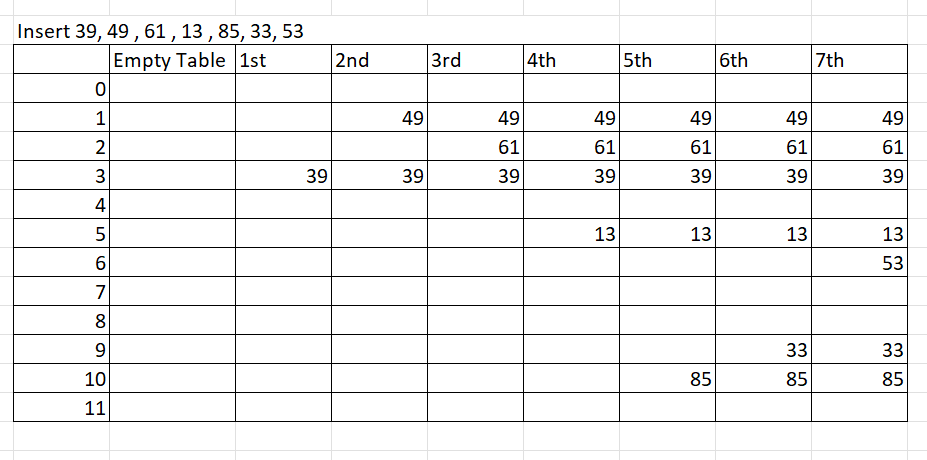

# Quiz 4 Practice

1) Which key and collision method is the following using? Write the code that finds the position.




```java


```

2) Continue this sort by hand step by step and write the code for it.


```java


```


2) Continue this sort by hand and write the code for it.


```java


```
